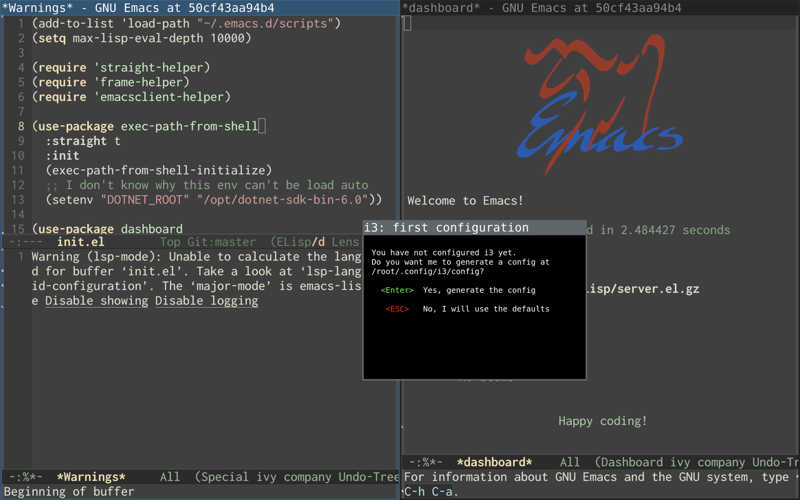

# Xorg Forward

A Xorg forwarding container that emulates wslg, to solve the problem that I can't make XQuartz display clearly on my Mac.

Like wslg, this one runs the Xorg server and forwards it via RDP. The difference is that wslg has a transparent RDP client for users, here it doesn't, you have to find a suitable client.

